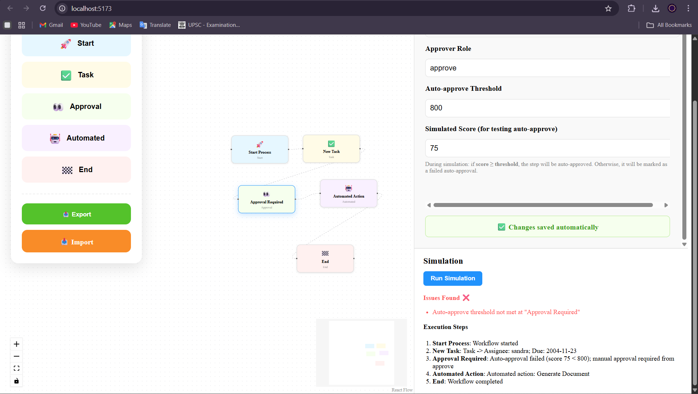
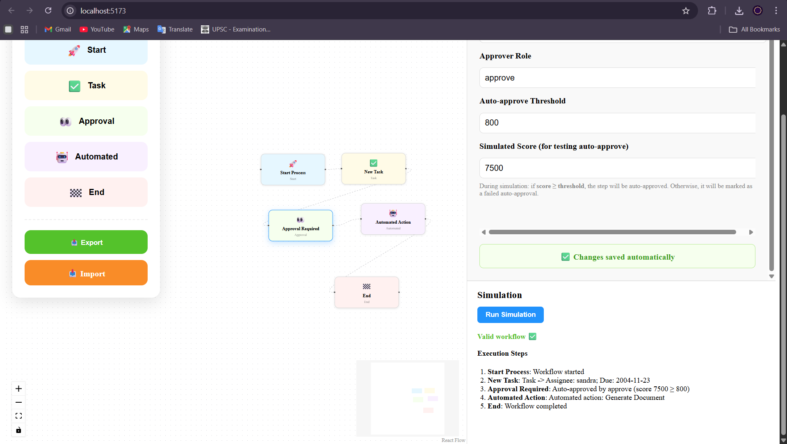

# HR Workflow Designer (React + Vite + React Flow)

A visual workflow builder to design and simulate Human Resources workflows.  
The application provides:

- A drag-and-drop React Flow canvas  
- Multiple workflow node types  
- Node configuration/editing panel  
- Auto-approval logic for approval nodes  
- A workflow simulation/testing panel  
- Mock API integration  
- Clean modular architecture suitable for scaling  

This project is delivered as a ZIP file **with no backend and no authentication**, as required.

---

# 📸 Screenshots (Add your images here)

> Replace the image paths with actual PNG/JPG files before submitting your ZIP.

### **1. Canvas View**


### **2. Node Configuration Panel**


### **3. Simulation Panel**


---

# 🚀 Features

### **1. React Flow Canvas**
- Add draggable nodes: Start, Task, Approval, Automated Action, End
- Connect nodes visually
- Import/export workflow as JSON
- Custom styled nodes with icons & colors

### **2. Node Configuration Panel**
Each node type has its own form:
- **Start** → metadata fields  
- **Task** → description, assignee, due date, custom fields  
- **Approval** → approver role, auto-approve threshold, simulated score  
- **Automated** → select action + dynamic parameter fields  
- **End** → message + summary toggle  

### **3. Mock API Integration**
- `getAutomations()` → supplies fake automation actions (email, Slack, docs)
- `simulateWorkflow()` → validates workflow and produces execution steps

### **4. Auto-Approval Logic**
Approval nodes now support:
- `autoApproveThreshold`
- `simulatedScore`
- If score ≥ threshold → auto-approved  
- Else → flagged as failed approval

### **5. Workflow Simulation / Sandbox**
Displays:
- Validity
- Issues
- Execution steps (with per-node messages)

---

# 🛠️ Project Architecture


---

# 🧩 System Design & Architecture Notes

### **1. State Management (App-Level)**

The central state lives in `App.tsx`:

- `nodes`: List of React Flow nodes
- `edges`: List of edges
- `selectedNode`: Current node being edited
- `automations`: Data from mock API
- `simResult`: Simulation results

State updates propagate downward to the canvas and form panels.

---

### **2. Node Editing Architecture**

Each node is associated with a **typed data object**:

```ts
AnyNodeData = StartNodeData | TaskNodeData | ApprovalNodeData | AutomatedNodeData | EndNodeData
